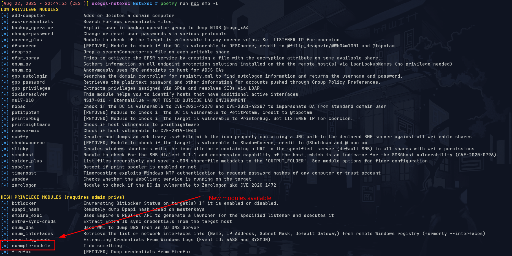

# nxc-module-personal-repo
This repository contains modules for the netexec tool. These are modules for most of them we were not PR at netexec’s repo or we were refused. I make them available anyway because they are useful to me, so can they be useful to someone else? 

A big thank for the work of Netexec devs.

Netexec repo : [https://github.com/Pennyw0rth/NetExec](https://github.com/Pennyw0rth/NetExec)

## Setup

```
⚠️ These modules have been tested mainly in lab environments and only rarely in production. Use with caution.
```

First, set up NetExec in a development environment by following the official documentation:

- [Install netexec using poetry](https://www.netexec.wiki/getting-started/installation/installation-on-unix#installation-for-development-using-poetry)

Once NetExec is installed, copy the desired Python module file into the following path:

```
cp smb/file.py /opt/NetExec/nxc/modules
```

Then, run NetExec with Poetry to load and use the new module:
```
poetry run nxc smb -L
```




